# SecureBank - Full CI/CD & GitOps Platform on Kubernetes


A production-style CI/CD platform built from scratch: a Spring Boot bank
app pushed through Jenkins → SonarQube → Nexus → Docker, deployed via
**ArgoCD GitOps** onto a self-hosted **Kubernetes (k3s)** cluster, with a
full **Prometheus / Grafana / Alertmanager** stack wired to real email
alerts — all running on Oracle Cloud at effectively $0 infrastructure
cost.

---

## 📌 Why this project matters

Most portfolio projects stop at "deployed an app to Kubernetes." This one
goes further: a real SonarQube quality gate that can fail a build, a real
GitOps loop where **git (not a person running `kubectl apply`) is the
source of truth** for what's running, and real monitoring that catches
and emails on actual production-style failures (a bad deploy, an
autoscaler misconfiguration, a session-affinity bug under load). Building
it surfaced and required root-causing 19 genuine issues across every
layer of the stack, from a Terraform/S3-backend incompatibility to a
Kubernetes autoscaler math bug — see [Notable engineering problems
solved](#-notable-engineering-problems-solved) below.

## 🧱 Architecture

```
 Developer push
       │
       ▼
 GitHub webhook ──► Jenkins CI
                       Compile → Test → Trivy (fs scan) → SonarQube
                       analysis → Quality Gate → Build → Publish to
                       Nexus → Docker build → Trivy (image scan) →
                       Push to DockerHub → commit new image tag back
                       to k8s/manifest.yaml  [skip ci]
       │
       ▼
 Git repo (k8s/ manifests) ── the single source of truth
       │
       ▼
 ArgoCD (GitOps) ──► continuously reconciles the cluster to match git
       │
       ▼
 k3s cluster (Oracle Cloud, single node)
  ├─ bankapp + MySQL                    (webapps namespace)
  ├─ ingress-nginx + MetalLB + cert-manager   (real Let's Encrypt TLS)
  ├─ Prometheus + Grafana + Alertmanager      (monitoring namespace)
  └─ Sealed Secrets, metrics-server
```

## ⚙️ What's actually running

- **App:** Spring Boot + MySQL bank app (register, login, deposit,
  withdraw, transfer), instrumented with Actuator + Micrometer
- **CI:** Jenkins - webhook-triggered, with a **two-layer loop guard**
  (see below), a Trivy scan at both filesystem and image stages, and a
  SonarQube quality gate that genuinely blocks a bad build
- **CD:** ArgoCD - full GitOps; Jenkins never runs `kubectl apply`
  against the app, its only job is updating an image tag in git
- **Monitoring:** kube-prometheus-stack, tuned for a resource-constrained
  single node; the app is scraped via a `ServiceMonitor`, with a custom
  `PrometheusRule` alerting on elevated HTTP error rates, routed to real
  email via Alertmanager (Gmail SMTP). A Grafana dashboard (request rate,
  error rate, pod restarts) was built from scratch
- **Autoscaling:** an HPA scales `bankapp` 2→4 replicas on CPU
- **Security:** Trivy vulnerability scanning (fs + image), Sealed
  Secrets for git-safe encrypted secrets, a scoped (not cluster-admin)
  Kubernetes ServiceAccount for Jenkins

### Why a single repo needs a loop guard

Jenkins commits the newly-built image tag back into this same repo's
`k8s/manifest.yaml`, and a GitHub webhook fires on *every* push,
including the automated ones which would normally re-trigger CI
forever. Two independent layers prevent it:
1. A **Guard stage** at the top of `Jenkinsfile-CI` that reads the last
   commit message and aborts immediately if it contains `[skip ci]` (the
   marker the manifest-update stage always uses), and diffs
   `HEAD~1 → HEAD` to also abort if every changed file is under `k8s/`
2. A **GitHub webhook path filter** excluding `k8s/**`

## 🛠️ Setup — reproducing this from scratch

### Prerequisites

- A free [Oracle Cloud](https://www.oracle.com/cloud/free/) account
- A domain name, or a free DDNS host (e.g. [DuckDNS](https://www.duckdns.org))
  — TLS certs need *some* real hostname
- A GitHub account with one empty repo (app source, Jenkinsfiles, and
  `k8s/` manifests all live together — see above for why)
- A DockerHub account
- An SSH client (MobaXterm, PuTTY, or similar) - nothing else needs to be
  installed locally; provisioning runs from Oracle Cloud Shell and then
  from the infra server itself

### 1. Bootstrap a dedicated infra server (from Oracle Cloud Shell)

A small, always-on box, separate from the cluster, holds Terraform /
Helm / kubectl and is where every setup step below runs from. Cloud
Shell, a free browser-based terminal Oracle runs inside OCI, with
Terraform/OCI CLI/kubectl/Helm preinstalled - solves the problem of 
creating the first server before any server exists to provision it, 
without installing anything locally or on the cloud.

```bash
# inside OCI Cloud Shell
git clone https://github.com/YOUR_USERNAME/YOUR_REPO.git
cd YOUR_REPO/infra/terraform/bootstrap
mkdir -p ~/.oci
openssl genrsa -out ~/.oci/oci_api_key.pem 2048
openssl rsa -pubout -in ~/.oci/oci_api_key.pem -out ~/.oci/oci_api_key_public.pem
cat ~/.oci/oci_api_key_public.pem   # paste into Console → My Profile → API Keys

cp terraform.tfvars.example terraform.tfvars   # fill in with your values
ssh-keygen -t rsa -b 4096 -f ~/.ssh/id_rsa -N ""   # for logging into the infra server later

terraform init && terraform apply
terraform output ssh_command
```

Download `~/.ssh/id_rsa` locally, then switch to MobaXterm/SSH into the
infra server's public IP - everything from here on runs there, not in
Cloud Shell and not on your own machine.

### 2. Provision the k3s cluster (from the infra server)

```bash
git clone https://github.com/YOUR_USERNAME/YOUR_REPO.git
cd YOUR_REPO/infra/terraform/cluster
terraform init && terraform apply
terraform output kubeconfig_fetch_command   # run the printed command
export KUBECONFIG=~/.kube/config-mega-devops
kubectl get nodes   # confirm Ready before continuing
```

### 3. Cluster-wide add-ons

Every other tool needs ingress, TLS, and secret encryption already in
place:

```bash
# ingress-nginx + MetalLB (bare-metal L2 load balancing — no cloud LB exists here)
helm install ingress-nginx ingress-nginx/ingress-nginx -n ingress-nginx --create-namespace
helm install metallb metallb/metallb -n metallb-system --create-namespace
# configure an IPAddressPool with the node's public IP

# cert-manager for real Let's Encrypt TLS
helm install cert-manager jetstack/cert-manager -n cert-manager --create-namespace --set installCRDs=true
kubectl apply -f k8s/cluster-issuer.yaml   # fill in your real email first

# metrics-server — k3s doesn't bundle it; needs one extra flag for k3s's self-signed kubelet certs
kubectl apply -f https://github.com/kubernetes-sigs/metrics-server/releases/latest/download/components.yaml
kubectl patch deployment metrics-server -n kube-system --type='json' \
  -p='[{"op":"add","path":"/spec/template/spec/containers/0/args/-","value":"--kubelet-insecure-tls"}]'

# Sealed Secrets — so real secrets never sit in git as plain base64
helm install sealed-secrets sealed-secrets/sealed-secrets -n kube-system
# install the matching `kubeseal` CLI locally on the infra server
```

### 4. CI tooling — Jenkins, SonarQube, Nexus

```bash
helm install jenkins jenkins/jenkins -n jenkins --create-namespace -f infra/k3s-addons/values-jenkins.yaml
helm install sonarqube sonarqube/sonarqube -n sonarqube --create-namespace
helm install nexus sonatype/nexus-repository-manager -n nexus --create-namespace
kubectl apply -f k8s/ci-tools-ingress.yaml
```

Then, in each UI:
- Jenkins: install the SonarQube Scanner + Pipeline plugins, add
  DockerHub/GitHub credentials, create a Multibranch/Pipeline job
  pointed at `Jenkinsfile-CI`, and add a GitHub webhook (path-filtered
  to exclude `k8s/**`)
- SonarQube: create a project + token, **and** configure a webhook back
  to Jenkins (`http://jenkins.<ns>.svc.cluster.local:8080/sonarqube-webhook/`)
  — without this the `Quality Gate Check` stage just hangs
- Nexus: create a `maven-releases`/`maven-snapshots` repo, matching
  `pom.xml`'s `<distributionManagement>`

### 5. Deploy the app + wire up GitOps

```bash
kubectl create namespace webapps
kubeseal --format yaml < mysql-secret.yaml > k8s/mysql-sealed-secret.yaml   # never commit the raw Secret
kubectl apply -f k8s/mysql-sealed-secret.yaml
kubectl apply -f k8s/manifest.yaml   # first manual apply only — ArgoCD owns it from here
kubectl apply -f k8s/ingress.yaml
kubectl apply -f k8s/hpa.yaml

# ArgoCD
kubectl create namespace argocd
kubectl apply -n argocd -f https://raw.githubusercontent.com/argoproj/argo-cd/stable/manifests/install.yaml
# if the applicationsets.argoproj.io CRD fails to apply (annotation-size limit), use:
#   kubectl replace --force -f <that CRD>
kubectl patch configmap argocd-cmd-params-cm -n argocd --type merge -p '{"data":{"server.insecure":"true"}}'
kubectl apply -f k8s/argocd-ingress.yaml
# create an ArgoCD Application pointed at this repo's k8s/ directory, syncing to the webapps namespace
```

### 6. Monitoring

```bash
helm install monitoring prometheus-community/kube-prometheus-stack \
  -n monitoring --create-namespace -f infra/k3s-addons/values-prometheus.yaml
kubectl apply -f k8s/bankapp-servicemonitor.yaml
kubectl apply -f k8s/bankapp-alerts.yaml
```

`values-prometheus.yaml` wires Alertmanager to Gmail SMTP (a Gmail App
Password, sealed the same way as the MySQL secret), tunes every
component's CPU/memory requests+limits for a single small node, and caps
Prometheus retention (`5d` / `4GB`) safely below its 5Gi PVC.

### Placeholders you must fill in before this runs

| Placeholder | Found in | Replace with |
|---|---|---|
| `YOUR_USERNAME`, `YOUR_REPO` | `Jenkinsfile-CI`, ArgoCD `Application` | your GitHub repo |
| `viz55` (DockerHub user) | `Jenkinsfile-CI`, `k8s/manifest.yaml` | your DockerHub account |
| `YOUR_REAL_EMAIL@example.com` | `Jenkinsfile-CI`, `k8s/cluster-issuer.yaml`, `values-prometheus.yaml` | your real email |
| `megprj-bankapp.duckdns.org` etc. | `k8s/ingress.yaml`, `k8s/argocd-ingress.yaml`, `k8s/ci-tools-ingress.yaml`, `values-prometheus.yaml` | your domain or DDNS host |
| `CHANGE_ME_LOCALLY` | `mysql-secret.yaml` (pre-sealing) | a real password — sealed via `kubeseal`, never committed plain |

## ✅ Verifying it works

Push a change to `src/` — you'll see it picked up by the Jenkins
webhook, flow through the full CI pipeline (compile → test → scan →
quality gate → build → push → tag commit), and land in ArgoCD as a new
`Synced` deploy, updating the live app at your domain with zero manual
`kubectl` intervention. If `BankappHighErrorRate` ever crosses 5% for 5
minutes, you'll get a real email.

## Some Screenshots of the Whole Stack

Screenshots from the actual running stack — not mockups.

### The application

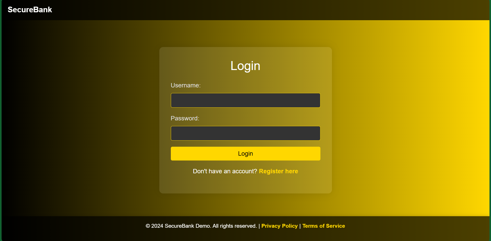
*Login page, served over real Let's Encrypt TLS.*

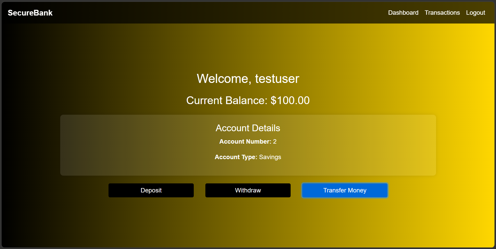
*Dashboard view after a successful login.*

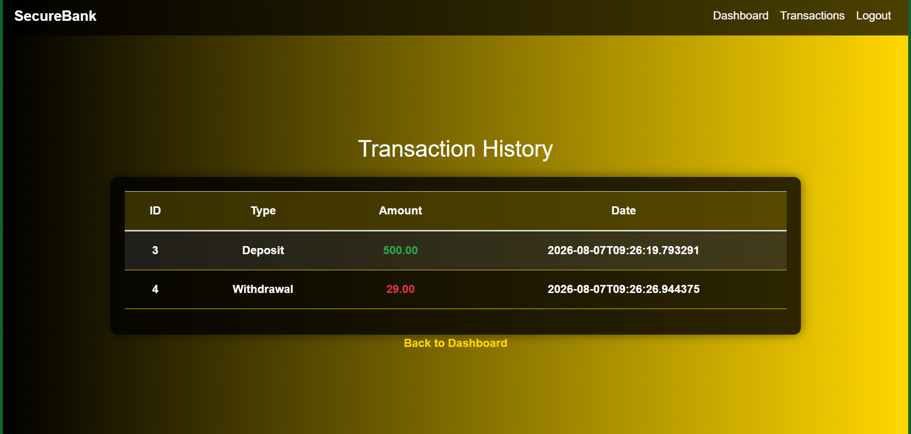
*A real deposit/withdraw/transfer going through end to end.*

### CI — Jenkins, SonarQube, Trivy, Nexus

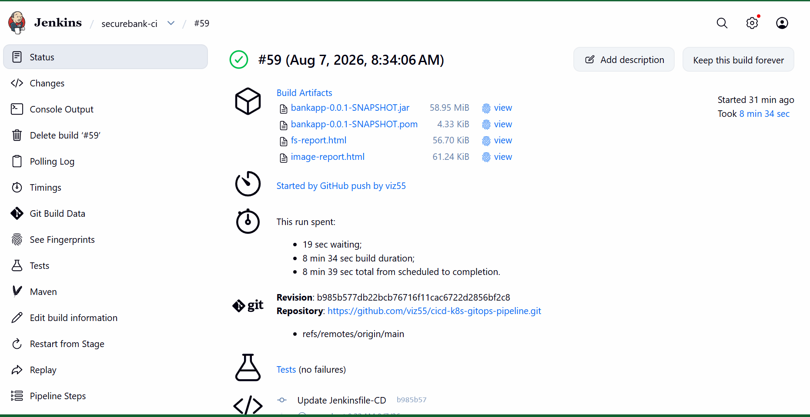
*Full pipeline run: compile → test → Trivy scan → SonarQube → build →
publish → image push → manifest commit.*

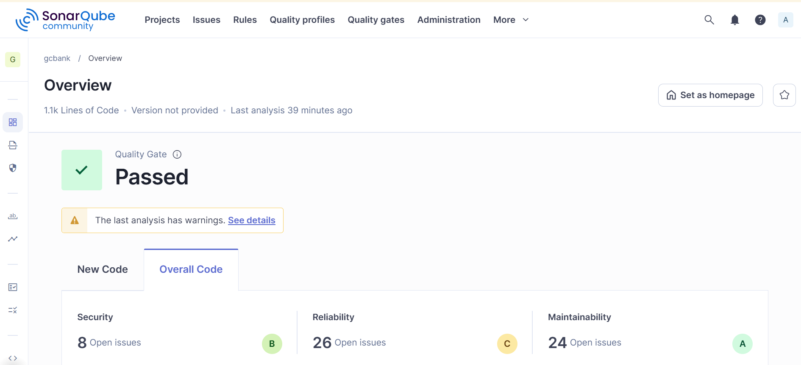
*A quality gate that can genuinely fail a build, not a decorative badge.*

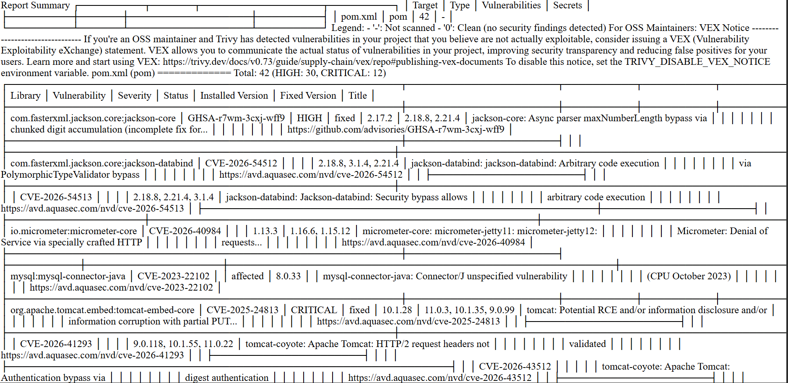
*Dependency vulnerability scan, archived as a build artifact.*

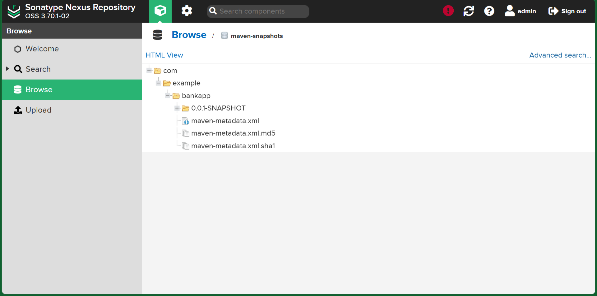
*Build artifact published to the self-hosted Nexus repository.*

### CD — ArgoCD

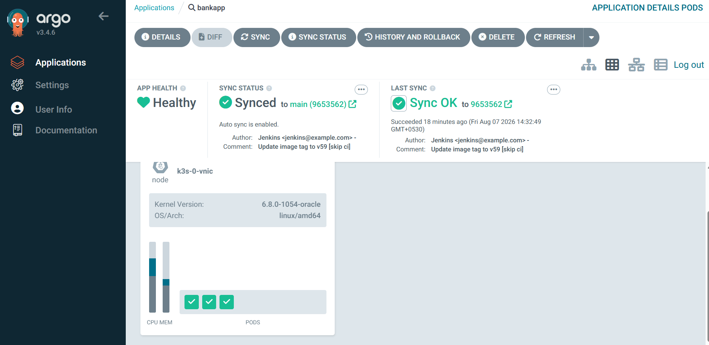
*GitOps in action — the cluster reconciled to match what's committed
in `k8s/`, with zero manual `kubectl apply`.*

### Monitoring & alerting

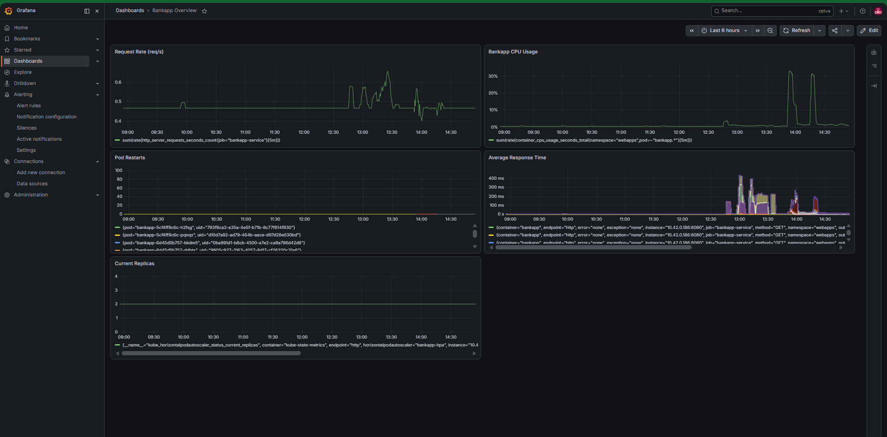
*Custom-built Grafana dashboard — request rate, error rate, pod
restarts — not an imported template.*

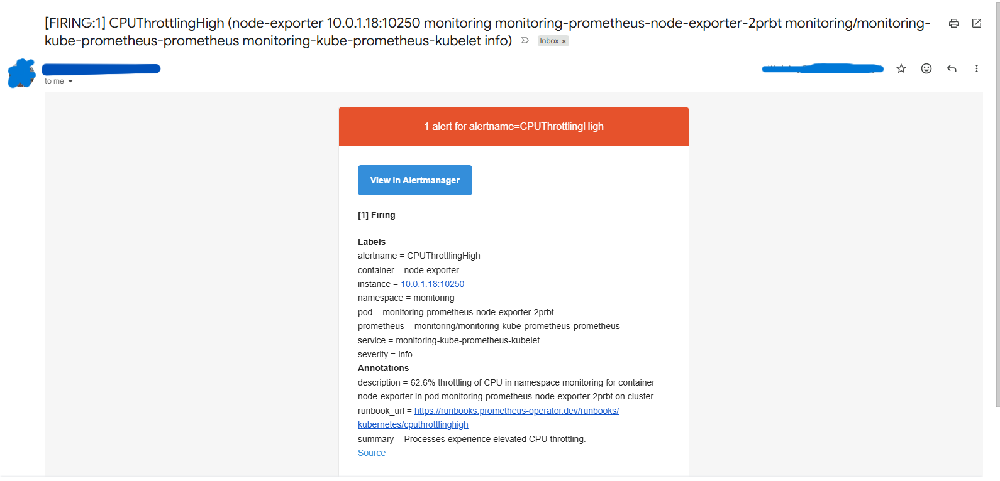
*A default kube-prometheus-stack alert (CPUThrottlingHigh) confirming
Alertmanager → Gmail SMTP delivery is genuinely working.*

### Infrastructure

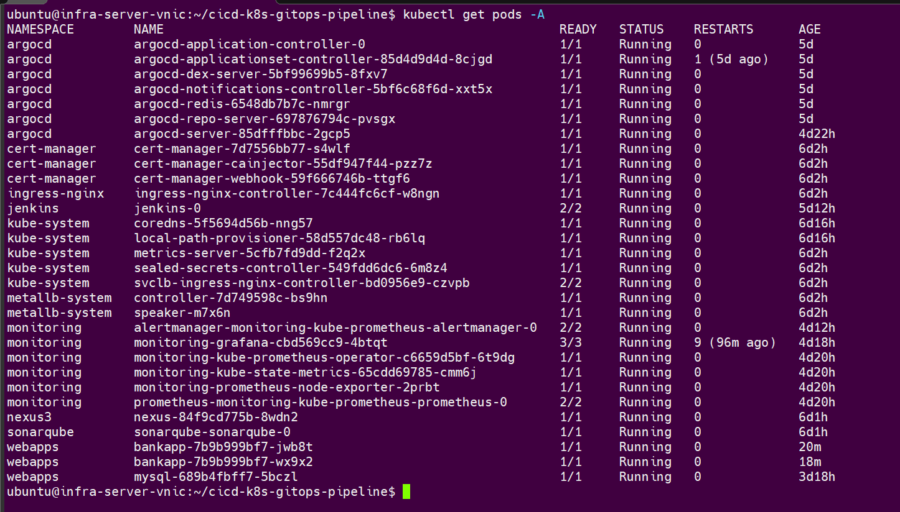
*The full stack: *app, CI tooling, GitOps, monitoring* running on a
single self-hosted k3s node.*

## 🎯 Notable engineering problems solved

A few of the more instructive ones — the rest were smaller variants of
the same categories:

- **Session affinity under horizontal scaling:** logging in worked at 1
  replica but silently failed at 2 - Spring Security's in-memory session
  store meant a login on pod A wasn't recognized by pod B on the very
  next redirect. Fixed with sticky-session ingress annotations
  (`nginx.ingress.kubernetes.io/affinity: cookie`).

  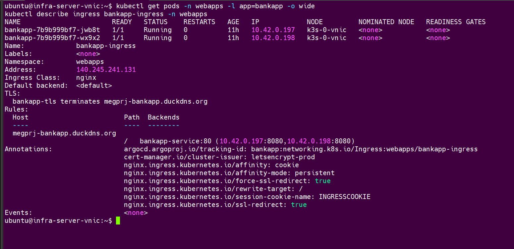
  *`kubectl describe ingress bankapp-ingress` — the affinity annotations
  actually applied, next to 2 healthy `bankapp` pods.*

- **HPA vs. GitOps ownership conflict:** ArgoCD and the HPA both claimed
  `spec.replicas`, flapping `OutOfSync`/`Synced` every ~60s. Fixed by
  removing `replicas:` from the tracked manifest and adding an
  `ignoreDifferences` block in the ArgoCD `Application`.

  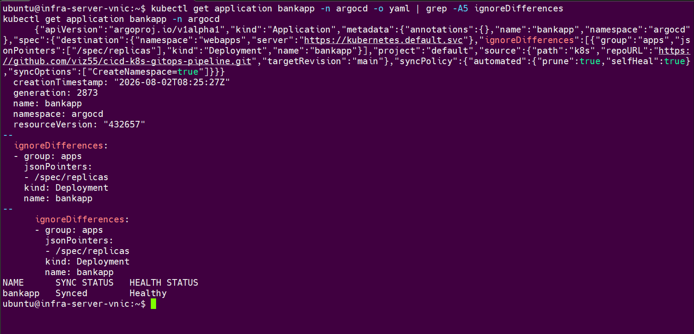
  *The `ignoreDifferences` block targeting `/spec/replicas`, with the
  Application sitting steady on `Synced`/`Healthy` — no more flapping.*

- **HPA memory scaling was a false equilibrium:** the JVM's near-fixed
  heap footprint gave memory-based scaling almost no real signal —
  "stable" isn't the same as "correct." Dropped to CPU-only scaling.

  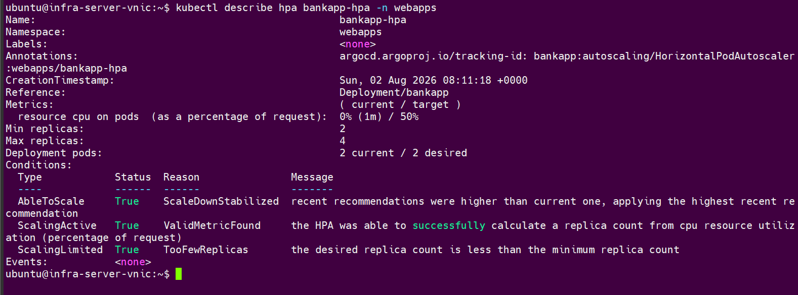
  *`kubectl describe hpa bankapp-hpa` — only a CPU resource metric
  configured, memory removed entirely.*

- **Reverse-proxy header trust:** `ingress-nginx` terminates TLS and
   forwards plain HTTP internally; without
  `server.forward-headers-strategy=framework`, Spring Boot's internal
  view of the request scheme didn't match the browser's real HTTPS
  context.

  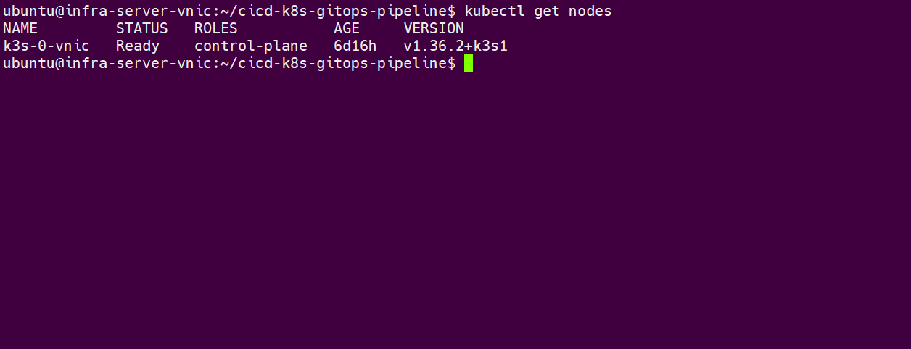
  *The one-line fix in `application.properties`.*

## 🔭 Beyond this demo

Given more than a single free-tier-adjacent node, the next architectural
layers would be: a multi-node, multi-AZ control plane for real high
availability, a managed or distributed storage layer instead of
`local-path` (so a node loss doesn't take a volume with it), no automated 
artifact/image retention policy yet and a dedicated secrets manager 
(Vault, or a cloud provider's managed equivalent) in place of Sealed Secrets.


## 🧰 Tech Stack

`Spring Boot` · `MySQL` · `Jenkins` · `SonarQube` · `Nexus` · `Docker` ·
`Trivy` · `ArgoCD` · `Kubernetes (k3s)` · `Prometheus` · `Grafana` ·
`Alertmanager` · `Sealed Secrets` · `MetalLB` · `ingress-nginx` ·
`cert-manager` · `Terraform` · `Oracle Cloud`

## 📄 License

See [LICENSE.md](LICENSE.md)
